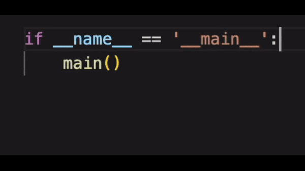

# once

once is a Python package designed to enforce coding guidelines effortlessly. It allows software architects to wrap all functions, classes, methods, etc., with decorators or apply metaclasses to all classes, ensuring consistent and maintainable codebases.

## Features

- Apply decorators to all functions, methods, and classes automatically.
- Enforce coding guidelines consistently across large codebases.
- Simple integration with existing projects.
- Flexible and customizable to fit various coding standards.

## Installation

To install the `once` package, simply run:

```sh
pip install once
```

## Usage

Use `once` at the entrypoint of your application. The example showcases how you can enforce coding guidelines globally.



### Modify Functions:
With once you can define custom decorators and apply them to all functions in your codebase.

```python
import once
import logging

from coding_guidelines import log_exceptions # <- This is a decorator
from some_custom_package import my_module


def main():
    result = my_module.do_stuff_1()
    my_module.do_stuff_2(result)


if __name__ == "__main__":
    (
        once.and_for_all.Functions()
        .apply_decorator(log_exceptions)
    )
    
    main()
```

### Modify classes:
You can also apply decorators to classes or their methods. In addition you can make use of metaclasses.

```python
import once

from coding_guidelines import (
    log_exceptions, # <- This is a decorator
    CheckMethodNames, # <- This is a metaclass
)
from some_custom_package import my_module


def main():
    result_handler = my_module.ResultHandler()
    result_1 = my_module.do_stuff_1()
    result_2 = my_module.do_stuff_2(result_1)

    result_handler.handle_results(result_1, result_2)


if __name__ == "__main__":
    (
        once.and_for_all.Functions()
        .apply_decorator(log_exceptions)
    )

    (
        once.and_for_all.Classes()
        .and_only_their_methods()
        .apply_decorator(log_exceptions) # <- apply the decorator only to the methods and not the class itself
    )

    (
        once.and_for_all.Classes()
        .apply_metaclass(CheckMethodNames)
    )

    main()
```

### Configuration
You can exclude specific functions and classes from the application of a decorator / metaclass. In addition you can limit the application to a given package.

```python
import once

from coding_guidelines import (
    log_exceptions, # <- This is a decorator
    CheckMethodNames, # <- This is a metaclass
)
from some_custom_package import my_module_1, my_module_2


def main():
    result_handler = my_module_1.ResultHandler()
    result_publisher = my_module_2.ResultPublisher()

    result_1 = my_module_1.do_stuff_1()
    result_2 = my_module_1.do_stuff_2(result)

    combined_results = result_handler.handle_results(result_1, result_2)
    result_publisher.publish_results(combined_result)


if __name__ == "__main__":
    (
        once.and_for_all
            .Functions()
            .exclude(names=["do_stuff_2"]) # <- Don't apply the decorator to function `do_stuff_2` 
            .apply_decorator(log_exceptions)
    )

    (
        once.and_for_all
            .Classes()
            .in_module(my_module_1)  # <- only apply the metaclass `CheckMethodNames` to classes in `my_module_1`
            .apply_metaclass(CheckMethodNames)
    )
    main()
```